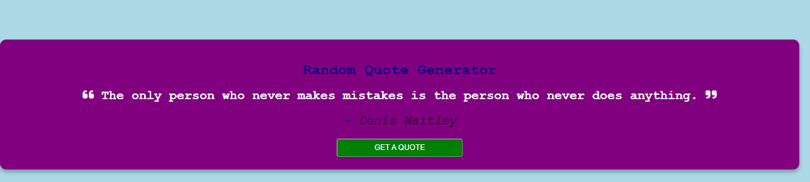

# random-quote-generator

## Description
The Random Quote Generator Web App is a sleek and modern random quote generator using JavaScript. With a glass morphism design, the website will display a title and a quote with the author's name. Using an API to generate these random quotes, and also learn how to create loading effects using try and catch methods and asynchronous functions. Additionally, discover how to use CSS to create the glassy morphism design. The end result will be a visually appealing and functional quote generator that is easy to use and update.

## Prerequisites
N/A

## Technologies Used
Built with:
* CSS
* JavaScript
* https://api.quotable.io/random API

## Installation
N/A

## Usage
N/A

## Project Link
Application can can be viewed here: 
* [Live](https://yvonnesarah.github.io/random-quote-generator/)

* [Repository](https://github.com/yvonnesarah/random-quote-generator)

## Screenshot
Random Quote Generator Example

## Credit
N/A

## Licence
Please refer to the LICENSE in the repo.